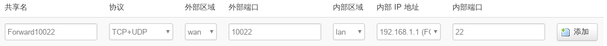
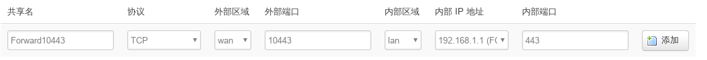

# Pandora-Phicomm-router-config port-forward

## 配置入口

主页: **网络**->**防火墙** 标签页选**端口转发**

## 配置

1. ssh转发

    ssh默认只在192.168.1.1(lan口)即内部监听, 如果需要外部访问，必须进行ssh端口转发,如下配置

    

    填好后按**添加**，再按**保存及应用**

    记得将root密码改的复杂点。 

1. https转发

    http(80)就不要转发了，其密码是明文传输，非常不安全

    https(443)默认只在192.168.1.1(lan口)内部监听, 如果需要外部访问，必须进行端口转发.如下配置

    

